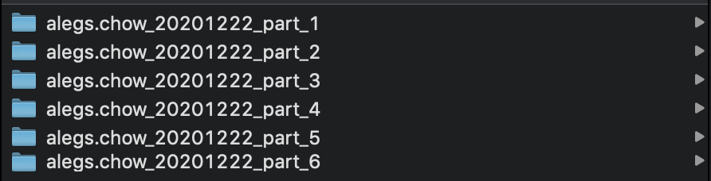
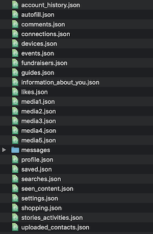
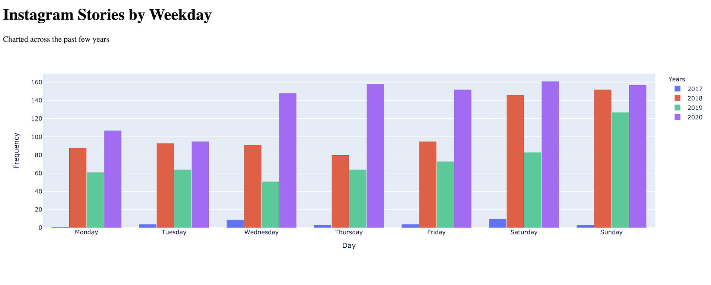
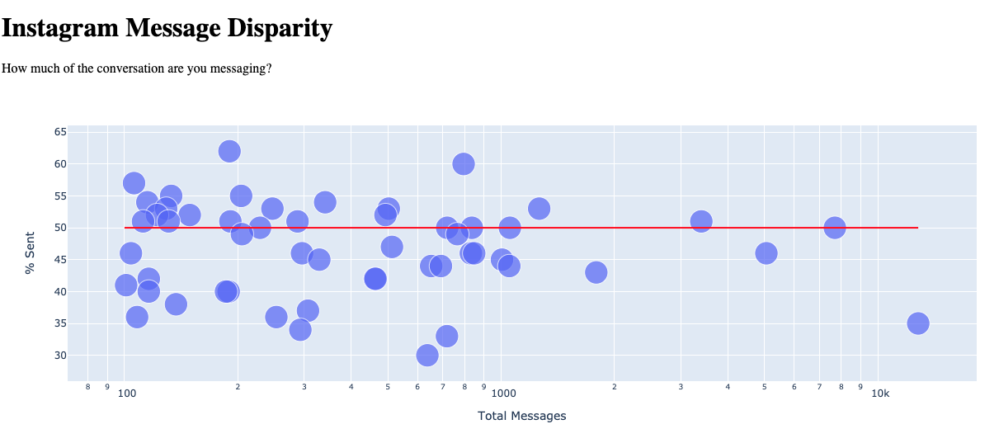

# Instagram Year in Review 🥳 ⒉𝟎⒉𝟎

Use your Instagram data to see your personalized "Year In Review".

## Setup

### Request Data from Instagram

_5 minutes, (request may take up to 48 hours)_

Instructions to request https://www.facebook.com/help/instagram/181231772500920 or https://www.instagram.com/download/request/

When Instagram is finished preparing your data, you will receive an email allowing you access to download your data in the form of several .zip files. If you have more data, you will have more files to download, and vice versa. Once you have unzipped the files, your file explorer will look something like this.



### Install Python3

_0-10 minutes_

You likely already have Python3 installed by default. **Be sure to use `python3` not `python`.** To check on MacOS, follow [these instructions](https://realpython.com/installing-python/#how-to-check-your-python-version-on-a-mac).
If not, follow [these steps](https://realpython.com/installing-python/).

## Steps

### Move Data

_5-10 minutes_

1. Navigate to the `instagram` project folder.
2. Create a folder called `data` (the path would therefore be `instagram/data`)
3. Open your `part_1` unzipped folder. Move all the contents of `part_1` to the `instagram/data` folder.
4. [Optional, for Stories data] Open the rest of the unzipped folders `part_2` -> `part_z` and move the `media.json` files into `instagram/data`. To avoid file name collisions, rename them to `media1.json`, `media2.json`, and so on.

Now, the `data` folder should look something like this.



### Run the Script

_1-5 minutes_

1. Open your command line and navigate to the `instagram` project folder.
2. Run `pip3 install -r requirements.txt`. This installs package dependences.
3. Run `python3 .`. This runs the `__main__.py` script. You should see the welcome message.

```
// Command Line
$ cd path/to/instagram
$ pip3 install -r requirements.txt
  ... Installing Requirements ...
$ python3 .
  Welcome to Your Instagram Year in Review!!!
  ...
```

## Visualizations

If you would like to explore different visualizations, look for files in this repository named `visualization_*.py`. You can run them with `python3 visualization_<filename>.py`. This will start a server running locally. The console will print the local address at which the server is running, so click on it (i.e. `http://127.0.0.1:8050/`). You should see a web page like so.




